# School Platform 2025

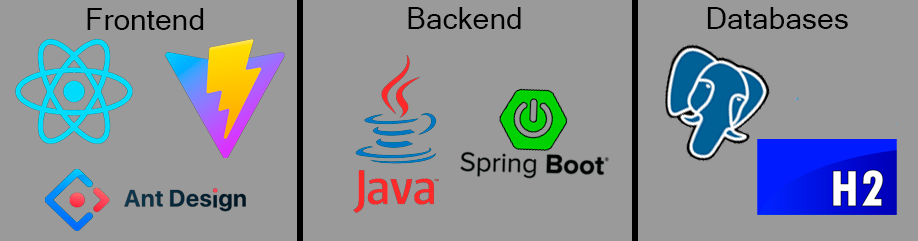

# Student Management System API

## Technology stack

- Frontend: Built with React and Vite for a fast and optimized development experience.
- Backend: Developed with Java 21, using Maven for project build management.
- Backend Framework: Spring Boot with Spring Data JPA, utilizing Lombok for reducing boilerplate code.
- Database:
    - Primary: PostgreSQL 17.3
    - Testing: H2 (in-memory)
- Containerization: Managed with Docker and Docker Compose.

## Project Architecture

- For this project was used 3-Tier Architecture.
- For student entity was created own Controller, Service, Repository(JPA)

## Student description

- A Student has an ID (id), full name (name), email (email) and gender (enum)

## Project Diagram

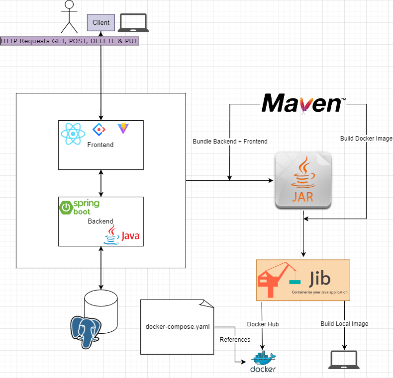

## API

### Requests

*For all these requests, Content-Type is `application/json`*

| Method   | Url                     | Passing Properties                                                                 | Description                                 | Example passing props                                                            |
|----------|-------------------------|------------------------------------------------------------------------------------|---------------------------------------------|----------------------------------------------------------------------------------|
| **GET**  | _`/api/v1/students`_    | -                                                                                  | Return a list of students                   | -                                                                                |
| **POST** | _`/api/v1/students`_    | JSON { "name": STRING ,  "email": STRING, "gender": "GENDER.(MALE,FEMALE,OTHER)" } | Create a new student with passed properties | { "name": "Ozzy Osbourne", "email": "ozzy.osbourne@mail.com", "gender": "MALE" } |
| **DEL**  | _`/api/v1/students/id`_ | -                                                                                  | Deleting a student                          | -                                                                                |
| **PUT**  | _`/api/v1/students/id`_ | JSON { "name": STRING ,  "email": STRING, "gender": "GENDER.(MALE,FEMALE,OTHER)" } | Update an existing student                  | { "name": "Ryan Gosling", "email": "ryan.gosling@mail.com", "gender": "MALE" }   |

## Handled Exceptions

| **Exception**                                      | **Where It's Used**              | **Trigger Condition**                                  | **HTTP Status**     |
|----------------------------------------------------|----------------------------------|--------------------------------------------------------|---------------------|
| `BadRequestException`       (Custom Exception) | `StudentService.addStudent()`    | When a **student with the same email already exists**  | **400 Bad Request** |
| `StudentNotFoundException`  (Custom Exception) | `StudentService.deleteStudent()` | When trying to **delete a student that doesn't exist** | **404 Not Found**   |

  
___

___

### Example Requests with Postman

> #### *Get All Students*
>
> 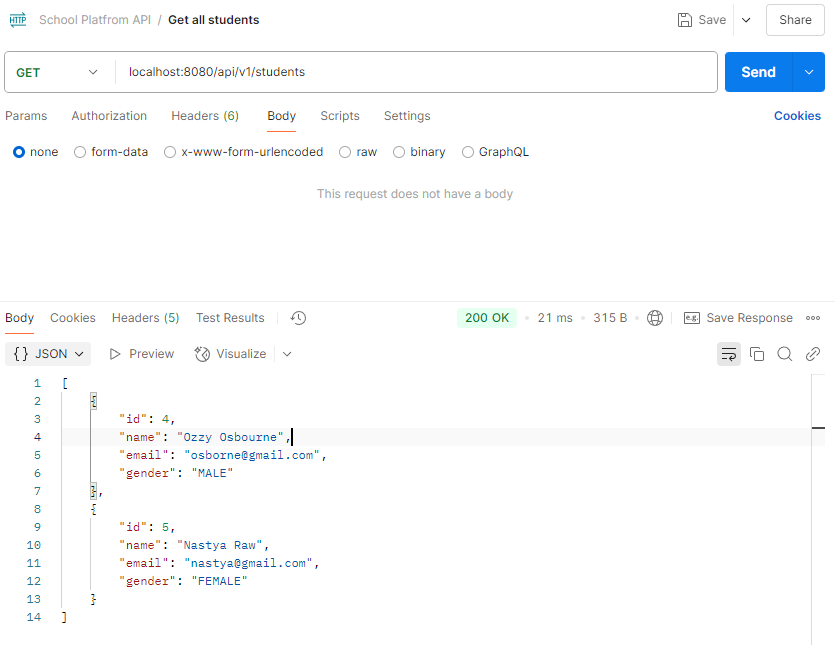

> #### *Add Student*
>
> 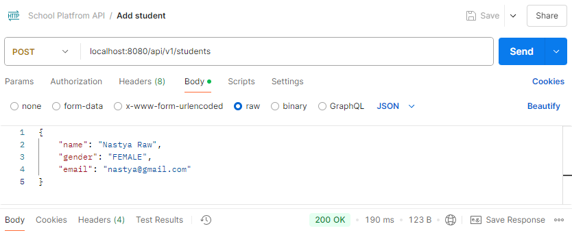

> #### *Delete Student*
>
> 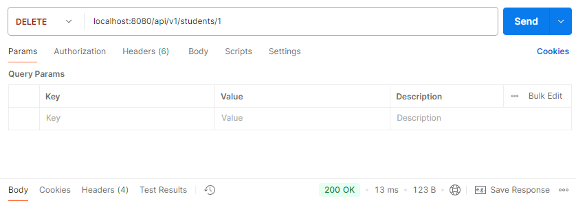

> #### *Edit Student*
>
> 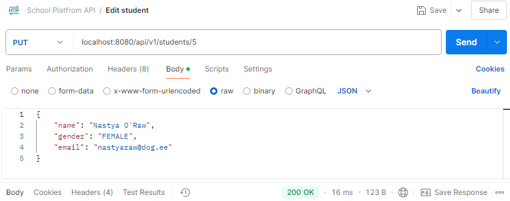

## Testing

### Test Structure

- `StudentIT` – Integration tests for student-related functionality.
- `StudentRepositoryTest` – Tests for the student repository layer.
- `StudentServiceTest` – Tests for business logic in the student service.
- `application.properties` – Main configuration for tests.
- `application-it.properties` – Configuration for integration tests.

### Example of testing
> #### *StudentIT*
>
> 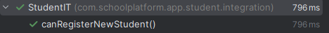

> #### *StudentRepositoryTest*
>
> 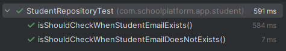

> #### *StudentServiceTest*
>
> 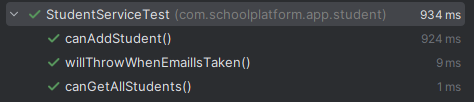

## UI Example 

> #### *Main Page*
> 
> 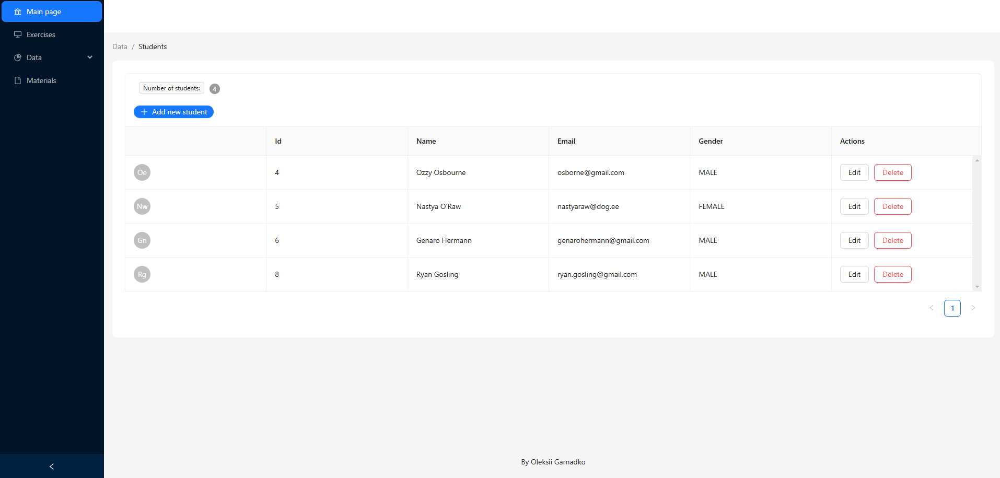

> #### *Main Page + Student Drawer(Add New Student) + Notification*
>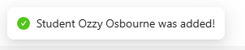
> 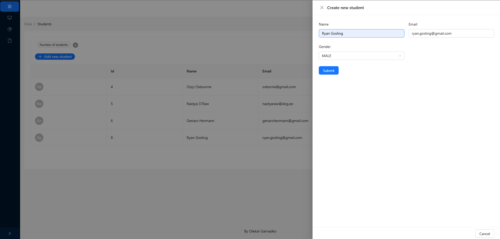

> #### *Edit Student*
>
> 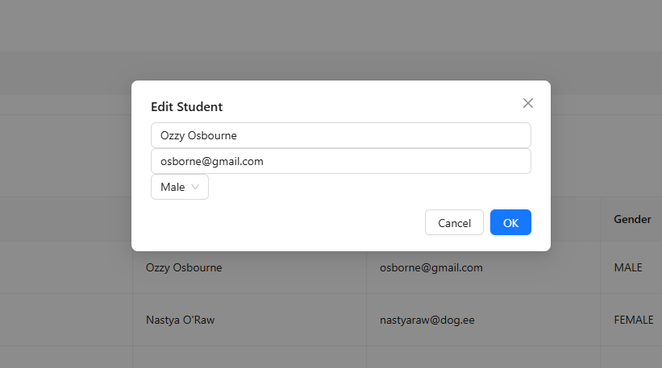

> #### *Delete Student*
>
> 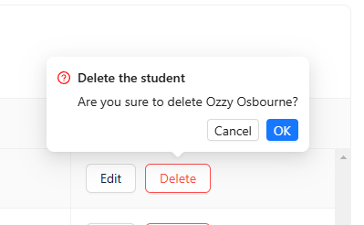